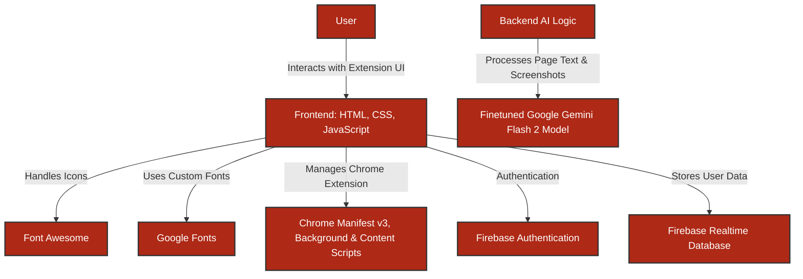

# **SmartGranny.ai**

**Empowering seniors to navigate the web with confidence, ease, and safety!**

**SmartGranny.ai** is an AI-powered Chrome extension designed to assist elderly users with online tasks. By combining AI-driven page text and screenshot analysis, SmartGranny.ai makes the web more accessible, safer, and simpler for seniors.

## 🚀 **Demo**

[Live Demo >](https://smartgranny-ai.web.app/)

> **Note:** API keys and database credentials have been removed from the codebase because of security reasons. When testing it on your local system, please replace them with your own valid APIs and credentials.

---

## 🎯 **Problem Statement**

Navigating the internet safely, confidently, and independently is a significant challenge for many seniors. **Complex webpages, small text, risk of scams, difficult forms, and overwhelming information** often lead to **frustration, confusion, and online vulnerability**. Traditional accessibility tools fail to provide **comprehensive, personalized, and easy-to-use assistance** tailored to the real needs of elderly users.

**SmartGranny.ai** **combines AI-driven page text and screenshot analysis with intuitive design to solve these problems**, empowering seniors to **browse the web safely, understand content easily, complete tasks independently, and enjoy a more accessible online experience** — all with friendly, AI-powered support.

---

## ✨ **Key Features**  

### **1. Chat About Page**  

> **Get instant help understanding any webpage. Our AI analyzes the page content and screenshots to explain things in simple terms, help with forms, and provide summaries. Just ask questions in plain language!**

---

### **2. Easy Reading Mode**  

> **Make any webpage easier to read by adjusting text size and contrast. Perfect for seniors who need larger text or better visibility while browsing. Reduce eye strain and make online reading comfortable with customizable settings that work across all websites.**

---

### **3. Scam Check**  

> **Stay safe online with our AI-powered scam detection. We analyze both text and screenshots to identify potential risks and explain them clearly. Get instant warnings about suspicious websites, phishing attempts, and online scams with easy-to-understand explanations of why they're risky.**

---

### **4. Voice Navigation**  

> **Control your browser with simple voice commands. Scroll pages or open websites by just speaking - no need to click small buttons. Navigate the web hands-free with natural commands like "scroll down" or "open Gmail", making web browsing more comfortable and accessible.**

---

### **5. Save Memories**  

> **Save important web pages and create custom notes for future reference. Never lose important information you find online. Organize your favorite recipes, health tips, and important documents with AI-generated summaries and your personal notes for easy access later.**

---

### **6. Draft Assistant**  

> **Get help writing emails and messages. Our AI understands the webpage context to suggest appropriate responses, making online communication easier. Write confident replies to emails, social media posts, and online forms with AI assistance that understands the context.**

---

## 🛠️ **Technology Stack**



- **Frontend:** HTML + CSS + JavaScript (Chrome Extension UI and Logic)
- **Extension Development:** Chrome Manifest (v3), Background & Content Scripts
- **Icons:** Font Awesome
- **Fonts:** Google Fonts
- **Database:** Firebase Realtime Database (RTDB)
- **Authentication:** Firebase Authentication
- **AI Processing:** Finetuned Google Gemini Flash 2
- **Screenshot Capture:** Chrome Tabs API

---

## 📋 **Impact & Benefits**

- **Empowers Independent Browsing:** With AI assistance, seniors can confidently navigate websites, fill out forms, and understand online content without needing external help.

- **Enhanced Online Safety:** AI-powered scam detection protects elderly users from phishing attempts, fraud, and malicious websites.

- **Improved Accessibility:** Adjustable text size, contrast settings, and voice navigation make web browsing easier, even for those with vision or mobility challenges.

- **Increased Digital Confidence:** By simplifying complex content and offering instant assistance, SmartGranny.ai builds confidence and reduces tech-related anxiety among seniors.

- **Personalized Assistance:** Every interaction is tailored using real-time page analysis (text and screenshots), providing accurate and context-aware support.

- **Memory Aid for Important Information:** Seniors can save important webpages with AI-generated titles and summaries, and also add their own personal notes — making it easier to organize, personalize, and recall important information later.

- **Seamless Communication Help:** Draft Assistant makes replying to emails, social media posts, and messages much simpler, helping seniors stay connected with family and friends effortlessly.

---

## 🚀 Getting Started

### Requirements:
- An updated Chrome web browser with JavaScript enabled.
- Stable internet connection for loading media and syncing data.

### Steps:
1: Download the extension folder and unzip it
2: Open Chrome and go to ```chrome://extensions/```
3: Enable "Developer mode" in the top right corner
4: Click "Load unpacked" and select the downloaded folder
5: The SmartGranny.ai icon will appear in your web toolbar

---

## 🤝 **Contributing**  

Contributions are always welcome! Please follow these steps:

1. Fork the repository.  
2. Create a new branch (`git checkout -b feature/your-feature`).  
3. Commit your changes (`git commit -m 'Add your message'`).  
4. Push to the branch (`git push origin feature/your-feature`).  
5. Open a pull request.  

---

Built with ❤️ to make web browsing safer, simpler, and more accessible for seniors using AI.
